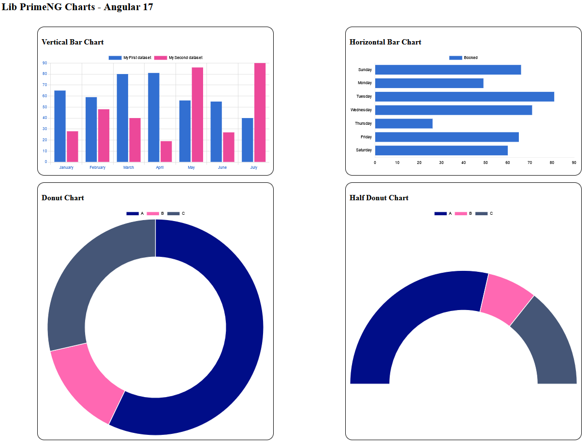

# PrimeNG Chart Angular 17 (em desenvolvimento)

This project was generated with [Angular CLI](https://github.com/angular/angular-cli) version 17.3.10.

## Development server

Run `ng serve` for a dev server. Navigate to `http://localhost:4200/`. The application will automatically reload if you change any of the source files.

## Configurations

Run `npm install primeng@17.0.0` to install PrimeNG.

Run `npm install chart.js@^3.9.1` to install Chart.js dependencies.

## Screenshots

Charts type vertical bar, horizontal bar, donut and half donut:

